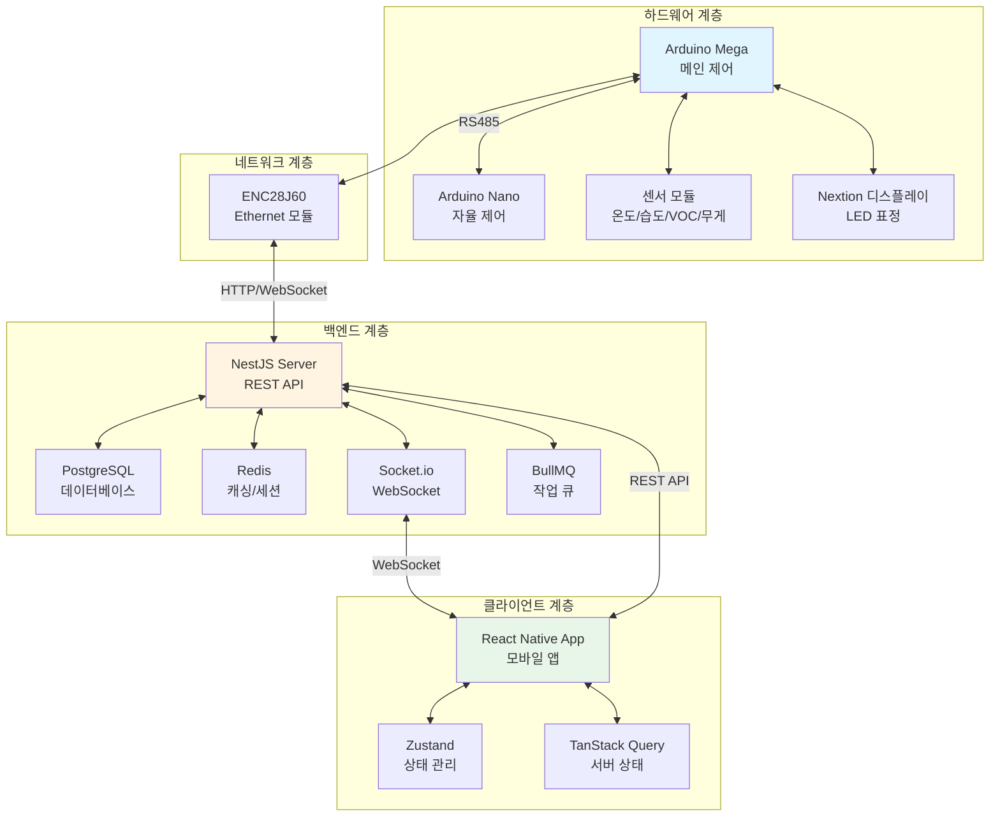

# Hanibi (한니비)

  

## 1. 프로젝트 개요

**Hanibi**는 AIoT 기반 반려 미생물 음식물 처리기로, 센서 데이터를 실시간으로 수집·분석하여 악취를 예방하는 스마트 디바이스입니다. 하드웨어(Arduino 기반 센서 시스템), 백엔드(NestJS 기반 서버), 클라이언트(React Native 모바일 앱)로 구성된 통합 솔루션입니다.

- **핵심 키워드**: AIoT, 음식물 처리기, 악취 예방, 실시간 모니터링, 감성 디자인
- **기술 영역**: 임베디드 시스템, 백엔드 API, 모바일 앱
- **통신 방식**: RS485, Ethernet, WebSocket, REST API

## 2. 프로젝트 소개

음식물 쓰레기 처리 과정에서 발생하는 악취는 주로 과투입이나 산성 음식물로 인한 pH 저하, 혐기성 미생물의 우세로 인해 발생합니다. 이러한 환경에서 암모니아, 황화합물, TVOC(Total Volatile Organic Compounds)가 생성되며 악취의 원인이 됩니다.

Hanibi는 이러한 문제를 사후 대응이 아닌 **예방 중심**으로 접근합니다. 온도, 습도, VOC, 무게 센서를 통해 실시간으로 미생물 상태를 점수화하고, 이상 징후를 조기 판단하여 미생물 상태를 안정화함으로써 악취를 원천적으로 차단합니다.

또한 단순한 기능성 디바이스를 넘어 **감성적 경험**을 제공합니다. LED 표정과 애니메이션을 통해 감정을 표현하는 디스플레이 UI를 구현하고, 의인화 기반의 감성 디자인을 통해 사용자와의 친밀감을 높였습니다. 이러한 접근은 프레임 비용 절감과 함께 사용자 경험을 향상시킵니다.

## 3. 프로젝트 목표

### 악취 예방
- 센서 기반 조기 탐지 및 이상 징후 판단
- 실시간 모니터링을 통한 자동 제어 및 알림
- 미생물 상태 안정화를 통한 악취 원천 차단

### 통합 연동
- 하드웨어(Arduino) ↔ 백엔드(서버) ↔ 클라이언트(모바일 앱) 간 실시간 데이터 동기화
- WebSocket 기반 양방향 통신 구현
- 디바이스 페어링 및 관리 시스템 구축

### 사용성 및 감성 UX
- 직관적인 모바일 앱 인터페이스
- 실시간 차트 및 리포트 제공
- 감정 표현 가능한 디스플레이 UI

## 4. 주요 기능

### 하드웨어
- **센서 데이터 수집**: 온도(SHT20), 습도(SHT20), VOC(SGP40), 무게(HX711 로드셀) 실시간 측정
- **상태 머신 제어**: IDLE → INPUT → MEASURING → MIXING → IDLE 순환
- **자동 제어**: 모터 사이클(60초 ON / 60초 OFF), 목표 온도 80°C(재가열 70°C)
- **이중 보드 구조**: Arduino Mega(메인 제어) + Arduino Nano(자율 제어), RS485 통신
- **디스플레이**: Nextion 터치스크린, LED 표정/애니메이션
- **네트워크**: ENC28J60 Ethernet 모듈을 통한 서버 연동

### 백엔드
- **센서 데이터 수집**: 하드웨어로부터 실시간 센서 데이터 수신 및 저장
- **요청 로깅**: API 요청 및 에러 로깅 시스템
- **디바이스 페어링**: 사용자-디바이스 연결 관리
- **실시간 업데이트**: Socket.io 기반 WebSocket 통신
- **에코 스코어 및 랭킹**: 환경 점수 계산 및 사용자 랭킹 시스템
- **API 문서화**: Swagger 기반 REST API 문서 제공

### 클라이언트
- **디바이스 페어링**: QR 코드 또는 수동 입력을 통한 디바이스 연결
- **실시간 모니터링**: 센서 데이터 실시간 표시 및 차트 시각화
- **디바이스 제어**: 원격 모터 제어 및 설정 변경
- **채팅 기능**: 디바이스와의 상호작용을 위한 채팅 인터페이스
- **리포트 및 랭킹**: 일일/주간 리포트 및 에코 스코어 랭킹
- **프로필 관리**: 사용자 프로필 및 설정 관리

## 5. 팀원 소개

| 이름 | 역할 | 비고 |
|------|------|------|
| 이상민 | 지도교수 | - |
| 정준수 | 주 기획, 하드웨어 담당 |팀장 |
| 유아름 | 캐릭터, 프로토타입 디자인 | 팀원 |
| 이주석 | 백엔드 개발, 서버 통신| 팀원 |
| 최현준 | 앱 기획, 앱 개발  | 팀원 |

## 6. 기술 스택

### 전체 스택 요약

| 영역 | 기술 스택 |
|------|-----------|
| **하드웨어** | Arduino Mega, Arduino Nano, RS485 통신 |
| **센서/모듈** | ENC28J60(Ethernet), HX711(로드셀), SHT20(I2C), SGP40(I2C), Nextion(디스플레이) |
| **백엔드** | NestJS, PostgreSQL, Redis, BullMQ, Socket.io, Swagger |
| **클라이언트** | React Native(Expo), TypeScript |
| **인프라** | Docker, Docker Compose |

### 백엔드 상세

| 기술 | 용도 |
|------|------|
| NestJS | REST API 및 WebSocket 서버 프레임워크 |
| PostgreSQL | 메인 데이터베이스 (센서 데이터, 사용자 정보 등) |
| Redis | 캐싱 및 세션 관리 |
| BullMQ | 작업 큐 관리 (비동기 작업 처리) |
| Socket.io | 실시간 양방향 통신 (WebSocket) |
| Swagger | API 문서화 및 테스트 인터페이스 |

### 클라이언트 상세

| 기술 | 용도 |
|------|------|
| React Native (Expo) | 크로스 플랫폼 모바일 앱 개발 |
| TypeScript | 타입 안정성 보장 |
| Zustand | 상태 관리 |
| TanStack Query | 서버 상태 관리 및 캐싱 |
| React Navigation | 네비게이션 라우팅 |
| Axios | HTTP 클라이언트 |
| Socket.io Client | 실시간 통신 클라이언트 |

## 7. 문서 자료

### 프로젝트 문서
- [하드웨어 README](/hardware/README.md) - Arduino 기반 하드웨어 시스템 상세 문서
- [백엔드 README](/backend/README.md) - NestJS 백엔드 서버 설정 및 API 문서
- [클라이언트 README](/client/README.md) - React Native 모바일 앱 개발 가이드

---

## 시스템 아키텍처

---

**Hanibi** - AIoT 기반 반려 미생물 음식물 처리기 프로젝트
